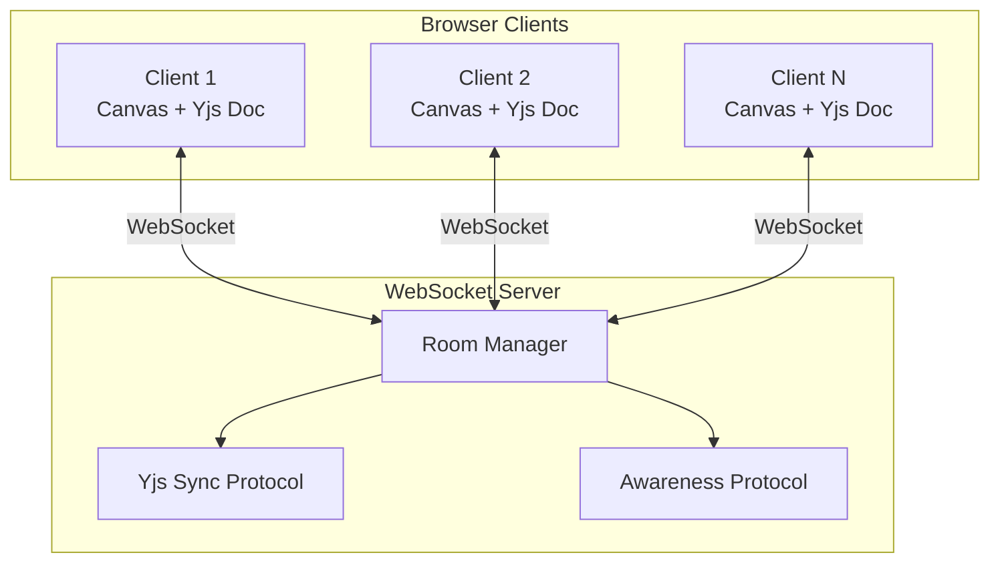
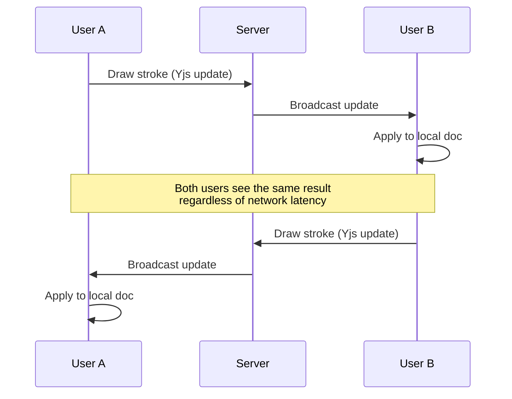
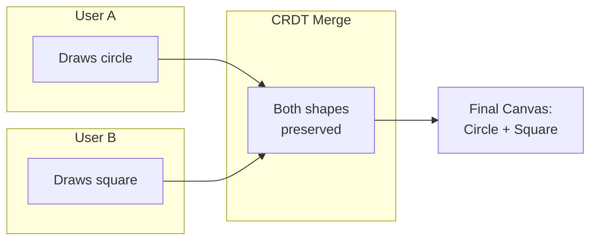
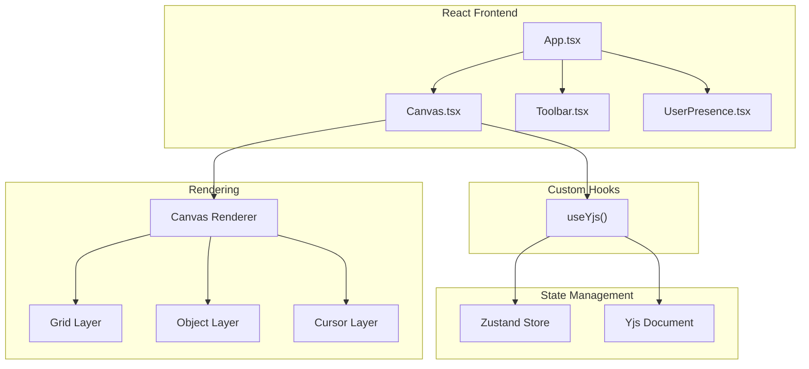

# Synapse

A real-time collaborative whiteboard built with React, TypeScript, and CRDTs. Multiple users can draw together on an infinite canvas with instant synchronization and conflict-free merging.

[Architecture](#architecture) | [Getting Started](#getting-started)

---

## Features

- **Real-time Collaboration** — Multiple users draw simultaneously with instant sync
- **Conflict-Free Replication** — Yjs CRDTs ensure consistent state across all clients
- **Live Cursors** — See other users' cursor positions in real-time
- **Infinite Canvas** — Pan and zoom to explore unlimited drawing space
- **Room-Based Sessions** — Share a 6-character code to invite collaborators

---

## Tech Stack

| Layer | Technology | Purpose |
|-------|------------|---------|
| Frontend | React 18, TypeScript, Vite | UI and rendering |
| Canvas | HTML5 Canvas API | Hardware-accelerated drawing |
| State | Zustand | Local state management |
| Sync | Yjs + y-websocket | CRDT-based real-time sync |
| Backend | Node.js, WebSocket | Room management and message relay |

---

## Architecture

### System Overview



### Data Flow



### CRDT Conflict Resolution



### Component Architecture



---

## Getting Started

### Prerequisites

- Node.js 18+
- Git

### Local Development

```bash
# Clone the repository
git clone https://github.com/matteso1/synapse.git
cd synapse

# Start the WebSocket server
cd ws-server
npm install
npm start

# In a new terminal, start the frontend
cd client
npm install
npm run dev
```

The frontend runs at `http://localhost:5173` and connects to the WebSocket server at `ws://localhost:1234`.

### Usage

1. Open the app and click **Create New Room**
2. Share the 6-character room code with collaborators
3. Draw together in real-time

---

## Project Structure

```
synapse/
├── client/                 # React frontend
│   ├── src/
│   │   ├── components/     # Canvas, Toolbar, UserPresence
│   │   ├── hooks/          # useYjs (CRDT integration)
│   │   ├── stores/         # Zustand state
│   │   ├── lib/            # Canvas rendering
│   │   └── types/          # TypeScript definitions
│   └── package.json
│
├── ws-server/              # Node.js WebSocket server
│   ├── server.js           # Yjs sync and room management
│   └── package.json
│
└── server/                 # Rust backend (production)
    ├── src/
    │   ├── main.rs         # Actix-web server
    │   ├── room.rs         # Room management
    │   └── protocol.rs     # Message types
    └── Cargo.toml
```

---

## Deployment

| Component | Platform | URL |
|-----------|----------|-----|
| Frontend | Vercel | synapse.nilsmatteson.com |
| WebSocket | Railway | wss://synapse-ws.up.railway.app |

### Environment Variables

**Frontend (Vercel):**

```
VITE_WS_URL=wss://your-railway-domain.up.railway.app
```

**Backend (Railway):**

```
PORT=8080  # Set automatically by Railway
```

---

## Roadmap

- [x] Freehand drawing
- [x] Real-time cursor sharing
- [x] Yjs CRDT integration
- [x] User presence indicators
- [x] Room-based collaboration
- [ ] Shape tools (rectangle, ellipse, line)
- [ ] Selection and transformation
- [ ] Undo/redo history
- [ ] Export to PNG/SVG

---

## License

MIT
